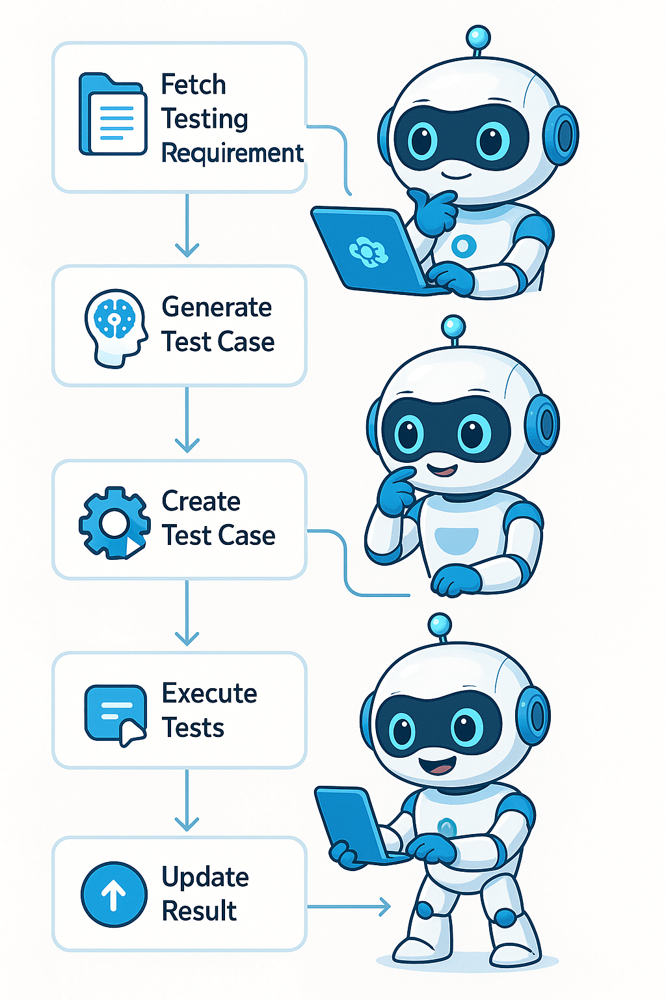

# 🌱 **TestPilot** for UI

### 💡 **Overview**

**TestPilot for UI** is a next-gen autonomous **AI Agent** built to streamline how test engineers validate user interface behavior. Leveraging the intelligence of modern LLMs, it seamlessly analyzes UI testing needs, constructs runnable tests, executes them, and communicates the outcomes—all without human hand-holding.

This isn’t automation as usual—it’s hands-free intelligence in action.

---

### 🧩 **The Challenge**

Designing and maintaining UI test cases by hand is really difficult to keep up-to-date in agile environments. Even with existing automation tools, engineers spend valuable time translating plain-language specs into test logic, which often introduces inconsistencies and gaps.

---

### 🚀 **How TestPilot Helps**

**TestPilot for UI** acts as a fully autonomous test executor that:

1. **Interprets** plain-language test intent using GenAI.
2. **Builds** test cases dynamically with reusable logic modules.
3. **Runs** the tests through automated drivers with real-time feedback.
4. **Delivers** test outcomes back through your existing channels.

---

### 🔄 **End-to-End Workflow**

1. **Retrieve Requirements** – The agent fetches test instructions from specs or stories.
2. **Parse & Process** – Converts these inputs into well-structured test case blueprints via the LLM.
3. **Write Test Scripts** – Populates a Python test file like `tests/ui_cases.py`.
4. **Launch Testing** – Runs the test suite and gathers execution results.
5. **Share Results** – Pushes feedback to relevant platforms or dashboards.

---

### 🛠 **Core Technologies**

* **LLM Backbone**: OpenAI GPT integration
* **Test Scripting Engine**: Python templates with modular injection
* **Test Runners**: Selenium, Playwright, or Pytest-based execution
* **Feedback Integration**: Webhook/API callbacks, chatbots, DevOps hooks
* **Autonomy Layer**: LangChain or LangGraph orchestration (modular)

---

### ✨ **What Sets It Apart**

* **Fully Independent**: From understanding to execution—no human in the loop.
* **Requirement-Centric Traceability**: Always knows which test maps to which story.
* **Effortless Onboarding**: Works with your test infra—no overhaul needed.
* **Scale-Ready**: Suitable for CI/CD pipelines in fast-growing UI ecosystems.

